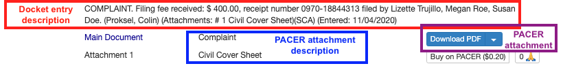

# FLP_Filing_Categories

As of March 26th, 2025

## Foreword

This project is the result of commuity effort within the Free Law Project and the broader legal community, see [GitHub ticket](https://github.com/freelawproject/courtlistener/issues/5123) for discussions.

## Goal

To create an AI model (or a collection of models) that categorizes docket entries and docket attachments.

### Use Case

The categories enable users to efficiently search for and identify dockets containing similar progressions, entries, and attachments related to their case of interest. Additionally, they provide users with quick access to examples of precedents from specific judges, jurisdictions, areas of law, and docket entry information—all at a glance.

Some key features the categories can help support are:
1. Important events alerts (outcomes, pleadings, etc)
2. Allow user to download cases or docket entries for a specific event
3. Search for specific events & filtering within a very long docket

### Multi-Stage Goals

1. Identify category ontology
2. Curate a dataset with "docket entry : category" pairs and "docket attachment : category" pairs to be used to train and evaluate ML models
3. Experiment with existing solutions to identify strengths and weaknesses

## Existing Solutions

Some existing solutions only encompass the category ontology, while other existing solutions include the ontology as well as the algorithm/model used for generating predictions.

### SALI

[Standard Advancement for the Legal Industry](https://sali.org/)

Created by the SALI Alliance
- A knowledge graph based ontology with ~18K classes, spanning "Area of Law" (eg, Patent Law), "Service" (eg, Appellate Practice), "Event (eg, Appeal), and many other classes.
- Click [here](https://webprotege.stanford.edu/) to open the webprotege, log in using username "rachlllg" and password "FLP!", select the "SALI" project, this is the latest version from their [GitHub](https://github.com/sali-legal/LMSS/tree/main)
- Additional [info](https://github.com/freelawproject/crm/issues/123) & [show case](https://youtu.be/zqC-uG0W-84?feature=shared)

Advantage:
- Most comprehensive
- Contains ~800 classes spanning numerous fields and levels, with ~500 unique classes

Disadvantage:
- Graph database is difficult for an average user to interpret
- Lots of tags not applicable for our use case

Note: Ontology only, no dataset or model

### SOLI/FOLIO

[Federal Open Legal Information Ontology](https://openlegalstandard.org/)

- Also a knowledge graph based ontology with 18k+ classes, spanning many classes, identical to SALI.
- [Here](https://soli.openlegalstandard.org/RBkL8I5saFF7mqpLTI7GxSh/html) for an interactive view of the `document types` classes
- Use the same webpotege login as above but select the "SOLI" project, this is the version from their [GitHub](https://github.com/alea-institute/FOLIO), I think they might have renamed it from SOLI to FOLIO

Note: Legal domain adapted base models to consider for finetuning:
- alea-institute/kl3m-doc-pico-001
- alea-institute/kl3m-doc-nano-001
- alea-institute/kl3m-doc-micro-uncased-001
- alea-institute/kl3m-doc-small-uncased-001

Note: No dataset, base model only, finetuning required

### Docket Alarm

[Docket Alarm](https://www.docketalarm.com/)

Created by VLex
- The [ontology](https://www.docketalarm.com/api/v1/#38_docket_report) is a subset of SALI, handpicked by annotators for Docket Alarm use cases
- [Example](https://www.docketalarm.com/cases/Minnesota_District_Court/0--18-cv-03321/National_Presto_Industries_Inc._v._U.S._Merchants_Financial_Group_Inc/) case with the ontology tagging on the applicable docket entry
- Contains 5 top-level class (motion, order, pleading, reply, and response) and majority of the bottom-level classes are focused on different motions

Advantage:
- Trimmed down from SALI, contains 229 unique classes
- One entry can have multiple classes (tags), which I think is the design we should use as well
- In addition to the tags, there are also outcomes of the motions (granted vs denied), which might be useful for our users
- Also, it shows a timeline view of the cases, from complaint to judgment, we should also consider this

Disadvantage:
- "Motion" focused, our ontology should include more important events in addition to motions
- The model was regex and algorithm based, we should consider using more advanced techniques such as language models for enhanced results

Note: Ontology only, no dataset or model, the code used to run prediction through the ontology is proprietary.

### SCALES

[SCALES](https://scales-okn.org/)

Created by SCALES
- The [ontology](https://docs.scales-okn.org/guide/ontology/) includes 25 events (high-level categories of activities in a case) and 57 attributes (additional details pertaining to an event).
- A much smaller set than SALI, SOLI, or Docket Alarm, does not have all the events or attributes but the ones included are somewhat common events.
- Based on their curated PACER [database](http://livingreports.scales-okn.org/#/coverageReport) of ~1M cases from the 94 federal courts spanning 2001 to 2022 with complete data from 2016-2017.

Advantage:
- More manageable size that covers the most important events
- They have manually annotated docket entries to train their own models (only the final multi-class model was released publicly, but the underlying models are binary classification models) for docket entry classification using these classes

Disadvantage:
- Not all events are covered
- Some classes are not events, but rather outcomes
- The dataset used for training and the binary classification models are not publicly available

Note: Ontology only, no dataset and the models we need (binary classifier models) are not publicly available, but there may be room for exchange/collaboration

### PACER

Court clerks often include descriptions to the docket attachments and we considered summarizing these descriptions to create an ontology. However, the challenges are:
1. PACER does not provide such ontology as the descriptions can determined by each court
2. Although court clerks have a general guidance on the descriptions, they are free to include any language in the attachments

We identified all unique descriptions from search_recapdocument which returned closed to 3M unique descriptions, which would require substantial cleaning. We also tried various ways to filter down the number of records, but the descriptions still require substantial cleaning and are in a standardized format. We threfore decided to hold off on going down this rabbit hole until a later time.

### Filing Dropdowns

We were also informed that attorneys need to select from dropdowns to identify the nature of their filings when they file documents with the courts. The dropdowns are maintained by the courts and we could reach out to the courts to gather such dropdowns. The challenges are:
1. Response rate from the courts
2. The dropdowns could advance over time

We therefore also decided to hold off on going down this route until a later time.

### Search Queries

Within the RECAP search environment, users can enter keywords into "document description" field to search for dockets that contain keywords in "document description". This could help inform us of what users are searching for in terms of document description.

We extracted all RECAP search queries that contain "description" and performed extensive cleaning, selecting ~250 descriptions based on a 95 percentile selection criteria based on frequency from ~5K queries.

The search queries are on the Search Queries tab of the [Google Sheet](https://docs.google.com/spreadsheets/d/1VKdL0md5OI54BsQCWzJLtNQn4jEGC6q4lyj5LnzADCw/edit?usp=drive_link).

## Application to FLP

1. We would like our classifier to work with both docket entries and docket attachments
2. Consider multi-tag for applicable entries
3. Consider using binary classifiers to allow for multi-tags and for flexibility of adding or removing tags
4. Consider outcome tag for motions
5. Consider timeline for case progression
6. Need to create our own ontology that combines the advantages from the existing solutions
7. The most promising model so far is from SCALES, as they are models that have already been finetuned and used, consider building on their models/methods instead of starting from scratch
8. Need to create (at the very minimum) an evaluation dataset of "docket entry : tag" pairs and "docket attachment : tag" pairs for model performance evaluation
9. Also consider creating training dataset if we need to build on SCALES models
10. Can also consider using generative models for classification

## FLP Ontology

The first step is to create an FLP Ontology, to do this, I started with summarizing the existing ontologies.

I started with the SALI ontology (for its comprehensiveness), then compared against Docket Alarm (which focused on motion types), and compared against SCALES (which considers both events and attributes). The resulting ontology contains more than 600 categories, from which we narrow down to Sup Classes / High-Level Classes (motion, notice, judgment, etc), Sub Classes / Finegrained Classes for select Sup Classes (motion to dismiss, motion to seal, notice of appeal, notice of motion, default judgment, etc), and Attributes for events (filed, returned executed, etc).

After multiple rounds of iterative review, by comparing the initial selection to SCALES and user search queries as well as identifying the classes for the sample dataset from RECAP, we preliminarily narrowed the classes down to ~25 Sup Classes and ~120 Sub Classes (for ~13 Sup classes out of the ~25 Sup classes). This will continue be revised and updated as we review the labels generated for the sample dataset. The attributes still need more work to be polished.

The prelimiary results are [here](https://docs.google.com/document/d/1m-h08ZixhiFlkCBeVRo3O__vY6_-cOMo4FwFwzdl2oU/edit?usp=drive_link).

## Dataset

Given SCALES is the only resource we identified that has a docket entry categorization model publically available with a sizable list of categories, we want to start by evaluating the SCALES model on our dataset. To do this, we will first analyze the distribution of data in both SCALES and RECAP to establish a general expectation on performance.

### SCALES distribution

The SCALES data distribution can be found in the [SCALES data coverage report](http://livingreports.scales-okn.org/#/coverageReport).

- Complete data from 2016-2017
- Temporal data spanning all years from 2002 to 2021 for the Northern District of Illinois, and data sprinkled from various jurisdictions and regions as available
- ~1M cases in total

### Population distribution

From our RECAP database, as of 3/19/2025, we have ~68M cases (search_docket), within these cases, we have ~419M docket entries (search_docketentry), and ~428M recap documents (search_recapdocument) of which ~15M (or ~3.5%) are available in RECAP (is_available = 't').

We performed some high-level EDA on the population data by looking at the distribution by year, by court name, by state, by circut, and by jurisdiction type. Details can be found in the 0.population_EDA.ipynb notebook.

Docket entries:
- Year: docket entries span from 2016 - 2025 with most cases from 2023 with 2019 being the next runner up

Dockets:
- Note that the docket distribution differs from docket entries, as some cases do not begin to have entries until some time after the case is created, and the number of docket entries per case differs
- Year: dockets span from 2014 - 2025 with most cases from 2021 with 2020 and 2019 being the next runner up.
- Courts: The largest number of cases are from N.D. Illinois, with C.D. California being the second largest, and M.D. Florida and S.D. Florida being the next runner up
- State: We have the most number of cases from California, Florida, Illinois, New York, and Texas.
- Circuits: these should not be considered separate from the courts, as they are simply cases that were not associated with a specific court in the database.
- Jurisdiction Type: The most number of cases are for Federal Question, and Diversity being the runner up.

### Sample distribution

We sampled 0.002% cases from search_docket and extracted all docket entries for the sampled cases, joined with search_court to identify the court details, joined with search_recapdocument to extract the PACER attachment descriptions and the plain texts from PACER attachments if available in RECAP. 

We dropped cases that don't have any docket entries in RECAP, as they do not have information we needed to perform the task. This resulted in 8,209 docket entries spanning 339 cases. This includes 2,228 docket entry descriptions, 6,583 PACER attachment descriptions, and 205 PACER attachment content in plain text.

Below is an example of how we define "docket entry description", "PACER attachment description", and "PACER attachment". Notice that for this particular entry, there are two attachments (which is why we have more PACER attachment descriptions than docket entry descriptions), however, of the two attachments, only one is available in RECAP, this is either because noone has purchased and contributed these attachments to RECAP, or because the attachment itself is sealed and not available.

Note that the SCALES model mentioned above is designed to classify the "docket entry description" based on solely on the information on the face of the docket sheet. In this example, the "docket entry description" should be classified as "complaint", signified by the capitalized letters at the front of the entry.

We then looked at the distribution of the sampled data to:
1. Ensure the sample distribution by year, by court, and by state are generally aligned with the population distribution, this ensures our evaluation on the sample dataset can be reasonably generalized to the population
2. Gain a general understanding of the sample data in more granular detail than the population

Details can be found in the 0.sample_EDA.ipynb notebook.

After performing some data cleaning, some key observations are:
- Year: dockets span from 2014 - 2025 with most cases from 2021 with 2018 and 2019 being the next runner up.
- Courts: The largest number of cases are from N.D. Illinois, with S.D. Texas being the second largest, and M.D. Florida being the next runner up
- State: We have the most number of cases from Texas, Florida, Illinois, New York, and Virgina.
- Jurisdiction Type: The most number of cases are for Federal Question, and Diversity being the runner up.
- Nature of Suit: The most number of cases are for 850 Securities/Commodities, with 442 Civil Rights: Employment being the next runner up.

This sample distribution is roughly in-lined with the population distribution, as expected. There is some discrepancy due to randomness, but in general, this sample represents the diversity of the population database.

We also created an interactive map view of the number of cases throughout the years similar to the SCALES coverage report. Comparing the sample dataset against the SCALES data, we see that our sample data generally covers more states and more recent years, this emphasizes the importance to evaluate the SCALES model on the sample data to obtain a baseline expectation of performance if deployed against the entire RECAP database.

## SCALES Model Eval

Detailed discussions on SCALES Model Eval can be found [in this ticket](https://github.com/freelawproject/courtlistener/issues/5255).

The conclusion is:
1. We need a slightly different ontology from SCALES
2. We should build on top the SCALES models (ideally, we get the binary classification models and the data they used to train the models)
3. SCALES model cannot be used directly for our use case due to limitations discussed in the ticket

## Baseline

Detailed discussion on the Baseline Model Eval can be found [in this ticket](https://github.com/freelawproject/courtlistener/issues/5294).

I selected GPT-4o-mini with a generic prompt as the baseline because:
- It is the quickest & easiest way to establish a model result without having to finetune a model to perform this task
- I wanted to evaluate whether a generic LLM is an option for this task
- This will allow us to evaluate the cost using finetuned encoder vs generic LLM model for this task
- With ~2K entries, this would only cost ~$0.12

The overall conclusion is:
1. Using a generic LLM can be quite costly for this task, also it's probably a bit of an overkill, we should look into finetuning an encoder model with a labelled dataset for this task

## Next Steps

1. Finalize the ontology
2. Finalize assigning labels to the eval dataset based on the ontology
3. Build on SCALES model to finetune encoder models for classification (may need to curate training dataset for this depending on how much SCALES is willing to share)