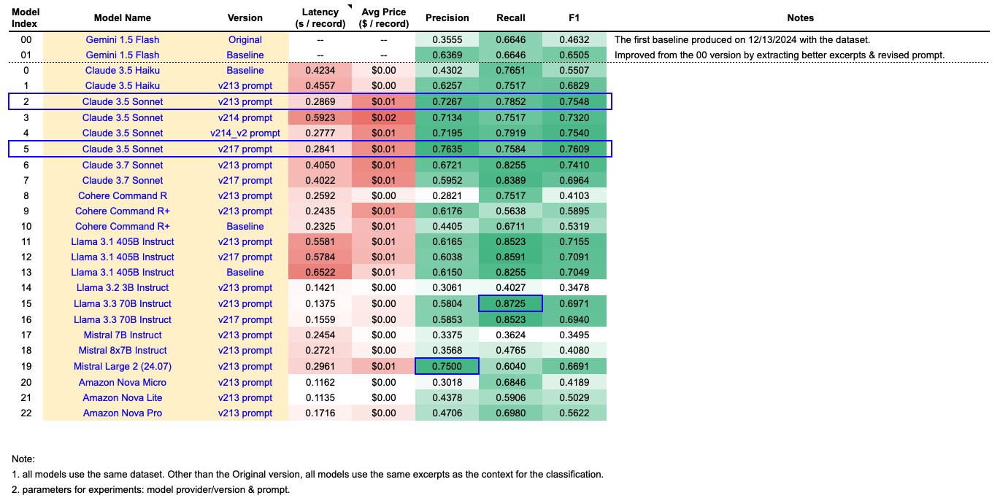
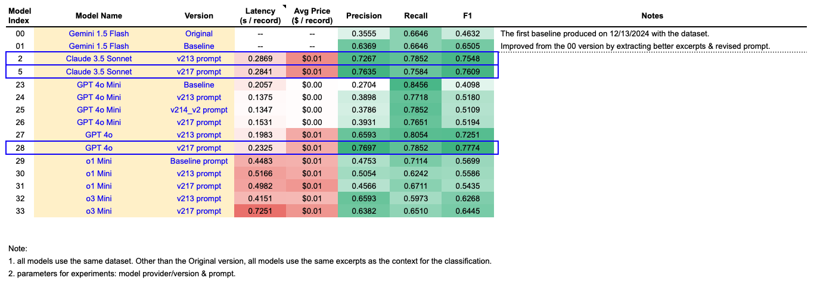
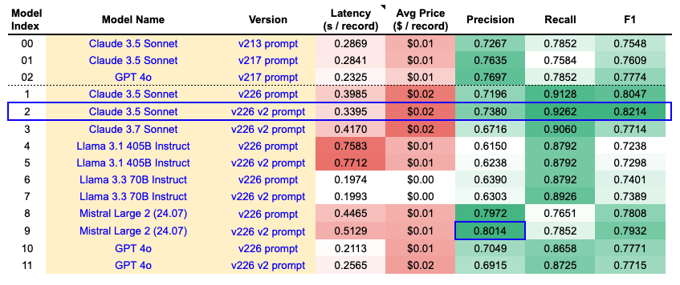

# FLP_Citator
As of February 28th, 2025

## Foreword
This project is the result of community effort within the Free Law Project and the broader legal community, see [GitHub ticket](https://github.com/freelawproject/courtlistener/issues/4963) for discussions and previous experiments.

## Goal
To create an AI Citator that helps users identify good law vs bad law through Case Law opinions.

### Legal Background
A legal citator is a research tool that helps users verify the validity and trace the history of court opinions, statutes, and other legal authorities. At its most basic level, a citator indicates whether a cited case has been overruled or remains good law. However, in practice, the treatment of a case can involve a range of classifications that vary in depth and impact. These classifications include affirmed, modified, reversed, criticized, distinguished, explained, overruled, questioned, and many more.

A comprehensive citator can help a user assess whether a case remains good law or has been undermined, guiding their decision on whether to use the case as precedent. Courts may reverse their own rulings, be overruled by higher courts, or see their authority eroded through repeated criticism from other courts. Court opinions can also be complex and difficult to interpret, making a comprehensive citator valuable and challenging to perfect.

### Multi-Stage Goals
Since creating a comprehensive Citator is a rather complex problem, we broke it down to more attainable bite-sized projects, each with its own goals, dataset, and experimental designs.

1. Stage 1: Overrule vs Not Overrule (SCOTUS)
2. Stage 2: Finegrained Classifications (Affirm, Overturn, Question, Disapprove, Criticize, etc.) (SCOTUS)
3. Stage 3: Strength and Depth of Treatment (Fully/Partially/Specific Topics, etc) (SCOTS)
4. Stage 4: Appellete Chain Classifications
5. Stage 5: Full Table of Authorities with Color-Coded Finegrained Classifications (including reversals and expand to courts outside of SCOTUS)

## Existing Solutions
The most notable and widely used citators are [LexisNexis’ Shepard’s Citations](https://www.lexisnexis.com/en-us/products/lexis/shepards.page?srsltid=AfmBOooa1oHGtJqFPaCsKkGAhwytVUmHiI67p20yCLGTapSRDZczxetu) and [WestLaw’s KeyCite](https://legal.thomsonreuters.com/en/products/westlaw/keycite). Some other solutions are [CaseText SmartCite](https://help.casetext.com/en/articles/3630136-smartcite-report-cite-check-and-analyze-a-brief), [vLex](https://support.vlex.com/document-types/case-law/cited-authorities), and [Paxton AI](https://www.paxton.ai/post/introducing-the-paxton-ai-citator-setting-new-benchmarks-in-legal-research). None of these solutions are freely available to the public.

Some datasets that can be used for training/evaluations:
1. [RegLab by Stanford](https://reglab.stanford.edu/data/)
2. [Congress.gov Decisions Overruled](https://constitution.congress.gov/resources/decisions-overruled/)
3. [Spaeth Dataset on Reversals](http://scdb.wustl.edu/documentation.php)

## Stage 1: Overrule vs Not Overrule (SCOTUS)

### Experimental Design

1. Create dataset:
   - Use the [Congress.gov Decisions Overruled](https://constitution.congress.gov/resources/decisions-overruled/) dataset as starting point
   - Sample 149 overruled opinions
   - Sample non-overruled opinions from [CourtListener](https://www.courtlistener.com/) to create a dataset of ~1,000 records, maintaining an overruled to non-overruled ratio of 15:100, reflecting the population distribution, where non-overruled opinions are much more common than overruled ones
2. Extract excerpts:
   - Use [CourtListener](https://www.courtlistener.com/)'s built-in Eyecite feature to extract excerpts surrounding a cited case (Target Case) from the citing case (Acting Case) opinion
3. Run experiments:
   - Use the dataset to run inference through numerous generative LLMs to classify the Target Case as overruled or not overruled, based on the excerpts
   - Improve the performance through prompt engineering and other prompting techniques
   - Compare model intelligence and identify a handful of generative LLMs as potential candidates
   - Consider finetuning the candidate LLMs with examples, to the extent finetuning as available
   - Also consider finetuning encoder models to perform specific classification tasks
4. Identify shortfalls in the excerpts extraction process, dataset composition, model intelligence, and modeling techniques, iteratively experiment and update until the desired benchmark has been met.

The desired benchmark for this task is 95% F1 score on overruling cases. Complete experimental results are available as pdf files from the img folder.

### Baseline experiments
In the baseline experiments, I used the dataset + excerpts previously generated for prior experiments for all models, with prompt engineering and model selection/intelligence as the experimental factors to:
1. craft enhanced prompts for improved performance, and
2. identify models with enough intelligence to perform the task with reasonable performance.

#### Bedrock experiments
I selected all text capable generative LLMs in Bedrock which are recent with the potential for successful performance.

Note that accuracy and specificity are omitted in the evaluation metrics as the dataset is highly imbalanced with not overruling being the predominant class. The latency is measured on ThreadPool 8 Core Apple M2 with 5 max workers. And the Avg Price is an estimate based on the input and output tokens returned by the model.

Based on the experiments, Claude 3.5 Sonnet have the best overall performance balancing precision & recall. Llama 3.3 70B showed strong potential with the highest recall with Mistral Large 2 showing strong precision. Cohere and Amazon Nova are eliminated due to poor performance, as well as some of the other older and smaller models. Claude 3.7 Sonnet did not beat 3.5 Sonnet but note that prompt engineering may be required to tweak the prompt & parameters better suited for the 3.7 Sonnet model.

Note that each version of the prompts are slightly tweaked to best suit each model based on the model API documentations.

#### GPT experiments
I also ran experiments through numerous OpenAI models.

Based on the experiments, GPT 4o with v217 prompt is now the model with the best performance, comparable to Claude Sonnet. GPT 4o mini did not show capability for good performance on this task, so not worth further exploration at this time. o3 mini outperformed o1 mini but neither displayed superior performance over the GPT models, more prompt engineering is likely requires to craft a prompt better suited for these reasoning models.

Note that the v213 and v217 prompts used for the reasoning models (o1-mini, o3-mini, and o1) were tweaked to better suite the reasoning models based on the documentation. Notably, step-by-step instructions were replaced with simpler instructions, and few-shots examples were omitted in the v213 prompt. Also, the reasoning models were allowed more max output tokens to account for the reasoning tokens.

Note that omitted o1 model is omitted from the experiments because based on a rough calculation of ~4k input tokens and ~3k output tokens per record (the reasoning tokens are counted towards output token price), at the price of \$15/1M input tokens and \$60/1M output tokens, running the o1 model through our 1K records (133 acting cases) would cost ~\$250. Even if the model is intelligent enough to get the results for all cited cases within each acting case (which is a big assumption in itself), this would translate to ~\$2 per opinion, which is not a sustainable pricing considering the volume of opinions.

#### Conclusion & Next Steps:

##### Conclusion:
The models selected for next round of experiments are as follows, starting with the one with the highest F1 score:
1. GPT 4o with v217 prompt
2. Claude 3.5 Sonnet with v213 prompt
3. Claude 3.5 Sonnet with v217 prompt
4. Claude 3.7 Sonnet with v213 prompt
5. Llama 3.1 405B Instruct with v213 prompt
6. Llama 3.3 70B Instruct with v213 prompt
7. Mistral Large 2 with v213 prompt

All other models are considered either not capability to succeed in or not suited for this task based on their performance (Precision, Recall, and F1).

##### Next Steps:
Dataset:
1. Need to use the latest Eyecite enhancements to identify reference citations in addition to full citations to extract better excerpts.
2. Need to separate lead opinion from other opinions in the excerpts (as the model sometimes confuse dissenting opinion with the lead opinion).

Prompt:
1. Examine prompt to identify additional room for improvement, including more explicit Chain-of-Thought (CoT) and ask the model to repeat the instructions & the target case name.
2. List out possible reference names for the Acting and Target Case to reduce confusion.

### v1 experiments

After reviewing some of the failed predictions from the baseline experiments, we see that some failures are due to

1. the language that explicitly overrules or affirms the target case are missing from the excerpts because the target case is referred to using reference citations, and
2. the excerpts did not separate lead opinion from concurring opinion from dissenting opinion, making it difficult for the model to determine which opinion represents the majority opinion

So, I wrote some scripts to:
1. include both full case citations and reference citations
2. use nltk.sent_tokenize to split the opinion to sentences and create excerpts based on sentence boundaries to avoid partial sentenced excerpts
3. separate different types of opinions (lead, concurrence, dissenting, etc) in the excerpts

Note that my scripts did not use an external source to resolve the citations, the reference citations that are ambiguous are therefore not resolved. To avoid providing the model with confusing targetCase tags, I removed the targetCase tags after extracting the excerpts and revised the prompts to adjust for the enhanced excerpts and the absence of the tags.

#### Experiments

Using the enhanced excerpts and enhanced prompts, I ran the winning models from baseline experiments to further identify the best model for this task (now that the excerpts should contain all the details the model need to make a determination). 

Note that the v226 prompt is built from the v213 prompt by adjusting the instructions to the new excerpts format, adding CoT, and have the model explicitly output the instructions and the target case name in an attempt to reduce case confusion. The v226_v2 prompt is built by combining the v217 and the v226 prompts to apply stricter rules and instructions on overrule vs not overrule.

#### Conclusion & Next Steps:

##### Conclusion:
Based on the experiments, the best model is Claude 3.5 Sonnet with v226 v2 prompt prompt, being the only model reaching 90%+ recall and 80%+ F1. Mistral Large again showed strong potential being the only model reaching 80%+ precision. Llama models and GPT models were not able to compete.

##### Net Steps:
Dataset:
1. The Case Law team will rerun the opinions with enhanced reference citations so once that is done, we can directly extract the excerpts with reference citations from CourtListener.
2. Review the predictions from the best model to better understand shortfalls and what needs to be done to further improve the results.
3. For finetuning, we need to either create a different dataset or split the current dataset to use for train vs eval.
4. Consider adding another "close call" class for cases that are difficult (even for a human) to distinguish.

Model:
1. Experiment with finetuning some of these models, to the extent allowed.
2. Consider RAG.
3. Consider finetuning an encoder only model for classification.
4. Consider model as evaluator.

## Files
I ran the experiments at the root of this folder and then later reorgnized the files into separate folders. The file paths in the notebooks will need to be updated if you want to rerun the notebooks.

On a high level, the files are organized as follows:
- 0.utils: python files with helper functions
- 1.preparations: notebooks used to prepare the datasets/excerpts for running the experiments
- 2.data: outputs of the preparation notebooks, these are the datasets/excerpts for running the experiments
- 3.experiments_baseline: notebooks & prediction outputs for baseline experiments
- 4.experiments_v1: notebooks & prediction outputs for v1 experiments
- evals_share: containing Pau's dataset, scripts, & results
- imgs: images used in this README