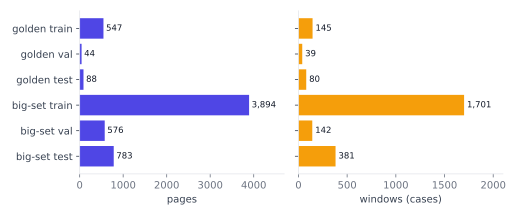
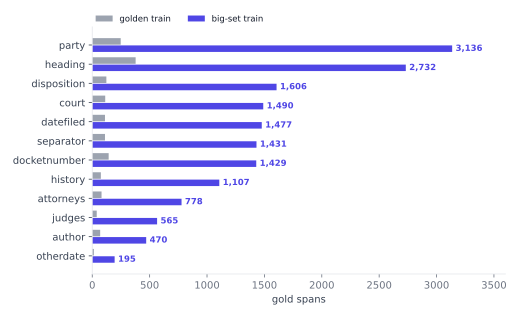
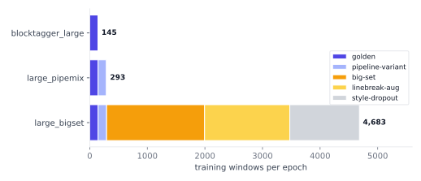
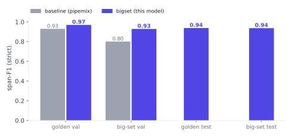
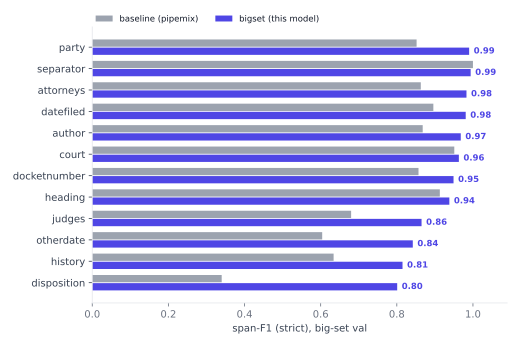
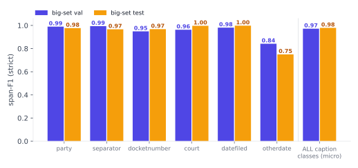
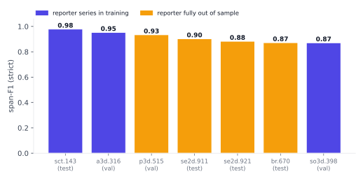

# Case-law block tagger — bigset-v1 delivery

The FLP block tagger labels the **structural components of a scanned
case-law opinion**: given an opinion's OCR'd text as minimal HTML, it
tags 12 element classes as character spans — party, separator,
docketnumber, court, attorneys, judges, datefiled, otherdate, history,
disposition, author, heading. Body prose is untagged; citations are a
separate future model.

This branch delivers:

- **the viewer** (this repo) — gold vs model predictions on the val
  and test sets, next to the redacted page scans;
- **the data bundle** (shared separately, never committed) — labels,
  predictions, and scans;
- **the model** — `blocktagger_large_bigset`, published to Hugging
  Face at
  [freelawproject/caselaw-block-tagger](https://huggingface.co/freelawproject/caselaw-block-tagger).
  Weights, tokenizer, and the model card (with a usage snippet) all
  live there; nothing model-related ships in this repo.

## Running the viewer

Requires [uv](https://docs.astral.sh/uv/) and the data bundle.

```bash
unzip /path/to/blocktagger_data_<date>.zip   # creates data/
uv run uvicorn app:app --port 8180
# → http://127.0.0.1:8180
```

- **Left rail** — evaluation windows grouped by reporter volume. One
  window = one court case (the model's input unit), up to 8,000
  tokens. `Δn` badges count model↔gold disagreements; "diffs only"
  filters to them.
- **Redacted scan** — the source page image(s) for the current window.
- **Gold vs predictions** — the exact model input text, spans colored
  by class (legend up top); the panes scroll together. Solid red
  outline = gold span the model missed · dashed red = model false
  positive · amber = same span, edge-punctuation difference only.
- **next diff ⇣** (or `.`) jumps through disagreements; `[` / `]`
  move between windows.

---

# Training & evaluation report

Snapshot 2026-08-26 (bigset-v1). All val AND test gold is
human-reviewed.

## Datasets

Windows are the model's input unit: one CASE (layout-detected caption
→ end-of-case marker), whole text blocks packed up to 8,000 tokens;
94% of cases fit one window. Tokens = CaseLawModernBERT tokenizer.
Footnote bands are stripped from every window.



| dataset | pages | cases | windows | tokens |
|---|---:|---:|---:|---:|
| golden train | 547 | 125 | 145 | 346k |
| golden val | 44 | 36 | 39 | 33k |
| golden test | 88 | 77 | 80 | 55k |
| pipeline-variant train¹ | (golden pages) | 125 | 148 | 357k |
| pipeline-variant val¹ | (golden pages) | 36 | 39 | 33k |
| big-set train (base) | 3,894 | 1,575 | 1,701 | 2,447k |
| big-set train linebreak-aug² | — | — | +1,480 | +2,362k |
| big-set val | 576 | 116 | 142 | 393k |
| big-set test | 783 | 347 | 381 | 556k |

¹ the same golden content re-serialized through the real OCR pipeline
with transferred labels — a text-shape variant, not new pages.
² augmented copies with a random 30% of internal block boundaries
collapsed to a space (spans remapped, adjacent same-label spans
re-merged) — robustness to OCR block segmentation.

### Volumes by split

The split is volume-level (a volume's pages are never divided across
splits), shared by the golden and big-set datasets alike:

| split | volumes |
|---|---|
| train (14) | a3d.216, a3d.237, a3d.248, f4th.60, f4th.108, f4th.155, ne3d.270, ne3d.273, nw2d.945, nw3d.24, sct.141, so3d.343, sw3d.707, sw3d.712 |
| val (3) | a3d.316, so3d.398, p3d.515<sup>†</sup> |
| test (4) | sct.143, se2d.911<sup>†</sup>, se2d.921<sup>†</sup>, br.670<sup>†</sup> |

Every val/test volume is unseen in training. <sup>†</sup> marks the
stronger condition: the volume's entire *reporter series* is absent
from training — the model has never seen that reporter's typography
or conventions at all. The golden pages come from twelve of these
volumes; the big-set extension added nine volumes across six reporter
series.

**Gold provenance:** the golden sets are seeded by Gemini then human-reviewed. The
big-set gold was seeded by golden model then human-reviewed — val and test
completely, train via targeted review flows.

### Class distribution (gold spans)

The big-set extension gives every class 10–20× the golden support:



| class | golden train | golden val | big-set train | big-set val |
|---|---:|---:|---:|---:|
| party | 248 | 50 | 3,136 | 202 |
| heading | 378 | 29 | 2,732 | 390 |
| disposition | 123 | 25 | 1,606 | 183 |
| court | 113 | 25 | 1,490 | 108 |
| datefiled | 111 | 25 | 1,477 | 106 |
| separator | 111 | 25 | 1,431 | 81 |
| docketnumber | 143 | 31 | 1,429 | 102 |
| history | 75 | 25 | 1,107 | 59 |
| attorneys | 81 | 51 | 778 | 121 |
| judges | 39 | 26 | 565 | 95 |
| author | 69 | 24 | 470 | 61 |
| otherdate | 14 | 0 | 195 | 28 |

## Training

Three generations, each warm-starting the next; the bigset run is a
~16× data increase over its predecessor:



All runs: HF Trainer token classification over 25 BIO labels, lr 3e-5,
linear schedule, 10% warmup, weight decay 0.01, effective batch 16,
bf16 + flash-attn, eval + checkpoint per epoch, best epoch by val
block-F1, early stopping.

| run | init | training data | rows/epoch | epochs | hardware |
|---|---|---|---:|---|---|
| blocktagger_large | CaseLawModernBERT-large | golden train | 145 | ~60 | A40 48GB |
| blocktagger_large_pipemix | CaseLawModernBERT-large | + pipeline-variant | 293 | ~60 | A40 48GB |
| **blocktagger_large_bigset** | warm start from pipemix best | + big-set base + linebreak-aug + style-dropout³ | 4,683 | 22 (best ~14; cap 100, patience 8) | H100 80GB, 12.3h |

³ style-dropout: an `<em>`/`<sup>`-stripped copy of every styled train
window, appended at train time.

The bigset run selects its best epoch on golden val + big-set val
mixed (182 windows).

## Evaluation

Span-F1 compares exact (start, end, label) sets after UNIFORM
normalization of gold and predictions alike: **strict** = content
anchoring (edges snapped off whitespace/markup); **normalized** =
\+ edge punctuation trimmed. No prediction post-processing.

### Overall (span-F1 strict / normalized)



| eval set | pipemix (baseline) | **bigset (this model)** |
|---|---|---|
| golden val | 0.930 / 0.932 | **0.970 / 0.975** |
| pipeline-variant val | 0.893 / 0.901 | 0.897 / 0.918 |
| big-set val | 0.801 / 0.813 | **0.929 / 0.935** |
| golden test | — | 0.938 / 0.939 |
| big-set test | — | **0.937 / 0.950** |

### Per class

Every class improved on the big-set distribution; the caption/
headmatter classes are at or near ceiling, and disposition — the
hardest class — more than doubled:



On the reviewed big-set test, the picture is similar (court 0.997,
datefiled 0.998, party 0.977, attorneys 0.969, docketnumber 0.968),
with two genuine weak spots: **judges 0.581** (unfamiliar concur-line
formats in the out-of-sample South Eastern 2d volumes) and
**disposition 0.772** (two-tier convention: a final short ruling plus
in-text holdings on order-list pages).

### Caption classes

The six classes that make up a case caption — party, separator,
docketnumber, court, datefiled, otherdate — are the fields most
downstream consumers extract. Aggregated (micro-F1 over the six):



| eval set | strict | normalized | gold spans |
|---|---|---|---:|
| big-set val | 0.972 | 0.973 | 627 |
| big-set test | 0.979 | 0.986 | 2,005 |

| class | val | test |
|---|---|---|
| party | 0.990 | 0.977 |
| separator | 0.994 | 0.967 |
| docketnumber | 0.949 | 0.968 |
| court | 0.963 | 0.997 |
| datefiled | 0.981 | 0.998 |
| otherdate | 0.842 | 0.750 |

Caption extraction is effectively production-grade; the only soft spot
is `otherdate` (argued/decided secondary dates), which is rare
(12–28 gold spans per set).

### Generalization by reporter series

No evaluation volume appears in training; what varies is whether the
model has seen *other volumes of the same reporter series*:



Fully out-of-sample reporters — Pacific 3d (p3d.515), South Eastern 2d
(se2d.911/.921), and the Bankruptcy Reporter (br.670, a domain shift
as well as a style shift) — land between 0.87 and 0.93, within ~6
points of the in-sample volumes. The best in-sample volume (sct.143,
Supreme Court Reporter order lists) reaches 0.979.

## Rebuilding the data bundle

On the machine holding the encoder datasets:

```bash
bash make_data_bundle.sh /path/to/ai-research-encoder/encoder
# → blocktagger_data_<date>.zip (labels + predictions + redacted scans)
```
