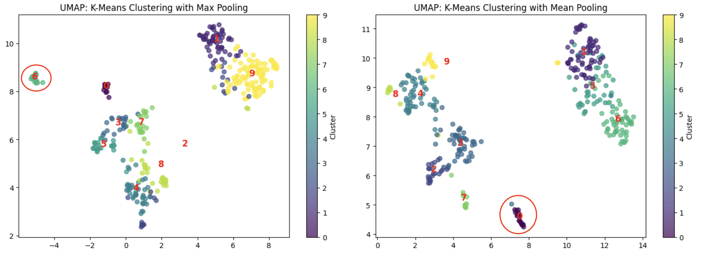

# FLP_Similar_Case_Search

As of April 4th, 2025

## Foreword

This project is the result of commuity effort within the Free Law Project and the broader legal community, see [GitHub ticket](https://github.com/freelawproject/ai-experiments/issues/11) for discussions.

## Goal

To create an AI-powered tool that enabled users to search for similar cases.

## Existing Solutions

There is currently a feature in courtlistener that shows a list of [related cases](https://www.courtlistener.com/opinion/107252/miranda-v-arizona/related-cases/) to the selected opinion powered by [ElasticSearch More Like This Query](https://www.elastic.co/guide/en/elasticsearch/reference/current/query-dsl-mlt-query.html). This feature is powered by TF-IDF, so based on keywords. Also, this is currently only available in case law search but not available in docket search (RECAP).

We would like our similar case search to be available for both case law search and docket search. Furthermore, since we will generate embeddings for the opinions, we would like to extend the existing TF-IDF based functionality to use semantic embeddings.

On a high level, different user defines "similar case" differently:
- Docket trajectory
- Dynamics of the court
   - Jurisdiction
   - Area of Law / Industry
   - Same type of plaintiff and defendant (eg. corp vs government, individual vs llc, etc)
- Semantics
- Citation network (eg. case A cites these 10 cases and case B also cites 8 out of these 10 cases)

Existing research:
- https://arxiv.org/abs/0909.1819
- https://arxiv.org/pdf/2309.08187
- https://aclanthology.org/2024.emnlp-main.73.pdf
- https://dl.acm.org/doi/10.1145/3477495.3531974
- https://arxiv.org/pdf/2309.02962

## Similar Case Search in Case Law

This is a relatively easier problem than similar case search in RECAP, since we already have the documents/opinions to compare the cases.

### Steps:
1. Identify whether an embedding based similar case search already exists in ElasticSearch:
   - No, but there are issues discussing the possibility of adding such feature, although the exact timing is unknown.
   - https://github.com/elastic/elasticsearch/issues/91158
   - https://github.com/elastic/elasticsearch/issues/118509
2. Generate embeddings for sample opinions and perform clustering to identify similar cases
   - Using the train split of the [semantic search dataset](https://huggingface.co/datasets/freelawproject/opinions-metadata) and the ModernBert-Base based finetuned embedding models (with [512 context window](https://huggingface.co/freelawproject/modernbert-embed-base_finetune_512) and with [8192 context window](https://huggingface.co/freelawproject/modernbert-embed-base_finetune_8192)), I generated the embeddings for the 503 opinions in the train set. 
   - The opinions are chunked to context window sized chunks and then embeddings are generated for each chunk. 
   - I then applied max pooling to aggregate the chunks such that I end up with one aggregated embedding for each document. I repeated this using the mean pooling approach to evaluate the difference using different pooling methods.
   - The embeddings are clustered using [KMeans clustering](https://scikit-learn.org/stable/modules/generated/sklearn.cluster.KMeans.html) and [HDBSCAN clustering](https://scikit-learn.org/stable/modules/generated/sklearn.cluster.HDBSCAN.html). For this quick exercise, I did not tune the hyperparameters when running the clustering algorithms, the hyperparameters should be tuned in future experiments.
   - To visualize the clustering results, I applied dimensionality reduction techniques (PCA, UMAP, and t-SNE) to project the high dimension embeddings onto a 2-dimensional space (again, for this quick exercise, I did not tune the hyperparameters when running the dimensionality reduction algorithms, they should be carefully tuned). PCA is not the most suitable dimensionality reduction technique for the data and HDBSCAN needs to be more carefully tuned, so visualization results hence forward only focus on KMeans clustering with UMAP and t-SNE visualization.

### Expectations:
Before reviewing the results, we should have some expectations, (kind of like null hypothesis but we are not performing a statistical test here):
1. There shouldn't be substantial difference between max pooling and mean pooling
2. Clustering results using longer context window should be better than that of the shorter context window, as there is less aggregation on the chunk-level embeddings
3. We should expect to see patterns of similarities for opinions within the some cluster

### Results - 8192 context window:

By simply looking at the opinions distribution, we can see some clear clustering, these are opinions grouped closer together. And there isn't a clear difference between max pooling vs mean pooling.

The first cluster that jumped out at me is Cluster 2 with max pooling and Cluster 7 with mean pooling. Upon inspection, they are indeed almost the exact same set of opinions. 

We inspected 10 examples from this cluster and noted they are all:
1. Cases with individual and government as the parties
2. Appeal cases
3. Cases involving criminal charges against the individual (murder, illegal possession/dealing, assault, bank robery, etc)

The 10 examples are:
- https://www.courtlistener.com/opinion/1083484/state-v-antonio-demonte-lyons/
- https://www.courtlistener.com/opinion/3544484/state-v-clark/
- https://www.courtlistener.com/opinion/2729050/darrius-woods-v-state-of-indiana/
- https://www.courtlistener.com/opinion/1427807/reed-v-state/
- https://www.courtlistener.com/opinion/1355714/state-v-collins/
- https://www.courtlistener.com/opinion/2681985/people-v-abdul-jaami-ca11/
- https://www.courtlistener.com/opinion/2114506/people-v-allen/
- https://www.courtlistener.com/opinion/2832035/united-states-v-ronald-moon/
- https://www.courtlistener.com/opinion/3155820/people-v-roberson/
- https://www.courtlistener.com/opinion/802681/united-states-v-zuber/

The next cluster that stood up was Cluster 0 with max pooling and Cluster 9 with meaning pooling. The two clusters again represented the same group of opinions and we selected 6 samples to inspect closely. These are opinions:
1. That contain only one sentence stating the outcome.
2. In regard to Petition for writ of certiorari.

The 6 examples are:
- https://www.courtlistener.com/opinion/5044497/cordes-v-board-of-zoning-adjustments-2010-0584-la-52110/
- https://www.courtlistener.com/opinion/8418535/thomas-v-tennessee/
- https://www.courtlistener.com/opinion/8418535/thomas-v-tennessee/
- https://www.courtlistener.com/opinion/9066386/akbar-v-united-states/
- https://www.courtlistener.com/opinion/8181956/rawls-v-penn-mutual-life-insurance/
- https://www.courtlistener.com/opinion/9278600/stevens-v-meacham/

With that, we confirmed the expectation that there is no substantial difference between max pooling and mean pooling, and there is a similarity pattern for opinions within the same cluster.

### Results - 512 context window:

Again, based on visual evidence alone, we see clustering of opinions.

I again inspected a few clustered and noted the Cluster 2 with max pooling and Cluster 7 with mean pooling are identical to that of the clusters with longer context, these are opinions with very short decisions regarding petition for writ of certiorari.

Examples are:
- https://www.courtlistener.com/opinion/8418535/thomas-v-tennessee/
- https://www.courtlistener.com/opinion/5044497/cordes-v-board-of-zoning-adjustments-2010-0584-la-52110/
- https://www.courtlistener.com/opinion/8949525/national-assn-for-the-advancement-of-colored-people-v-harrison/

Another cluster I inspected is Cluster 9 with max pooling and Cluster 2 with mean pooling, similar to the cluster with the longer context, these are opinions with individual and government as the parties regarding the individual's criminal conviction and appears in the appellate court.

Examples are:
- https://www.courtlistener.com/opinion/4587088/sharon-louie-v-state-of-indiana-mem-dec/
- https://www.courtlistener.com/opinion/1427807/reed-v-state/
- https://www.courtlistener.com/opinion/4313520/state-v-vaughn/
- https://www.courtlistener.com/opinion/1355714/state-v-collins/
- https://www.courtlistener.com/opinion/2681985/people-v-abdul-jaami-ca11/
- https://www.courtlistener.com/opinion/802681/united-states-v-zuber/

With that, we again confirmed the expectation that there is no substantial difference between max pooling and mean pooling, and there is a similarity pattern for opinions within the same cluster.

However, we do not see a substantial difference in the clustering quality between longer context window vs shorter context window, there is an inherent randomness in the clustering result (as this is a unsupervised technique), but overall, there is no clear evidence of substantial difference in the clustering quality between longer context window vs shorter context window. So, we should be able to use the same embeddings generated for semantic search for clustering.

On memory requirements, the clustering algorithm is run on a CPU and is very fast. If we use the same short-context window embeddings for clustering, we should expect ~125GB to ~250GB of RAM to load all embeddings (I do not recommend int quantization as we need the floats to get the finegrained differences among the embeddings for clustering). If we use the longer contex window, we should expect ~16X smaller RAM requirement, so ~8GB to ~16GB. 

## Similar Case Search in RECAP
Similar Case Search within RECAP / docket search is more tricky than case law as there isn't a clearly defined document to based on the search off of. 

Users might be interested in searching for cases with:
- Similar citations
- Similar docket trajectory
- Similar legal issues
- Similar initial complaints
- Similar parties

Each of these would depend on additional features to be added. For example, to look for cases with similar citations, it would require us to [identify overlap citations between cases](https://github.com/freelawproject/foresight/issues/87). To look for cases with similar parties, it would require us to [identify the party types](https://github.com/freelawproject/courtlistener/issues/5341). Furthermore, all of these may benefit in one way or another by utilizing [docket / filing summaries](https://github.com/freelawproject/ai-experiments/issues/3) and [docket / filing categories](https://github.com/freelawproject/ai-experiments/issues/10). 

Given the dependencies with other ongoing experiments, for this excercise, I focused on exploring the semantic clustering potentials by utilizing:
- Docket trajectory approach: by using plain English description of docket entry description, attachment description, and attachment content as well as case metadata as features to generate embeddings for clustering
- Complaints approach: Complaints attachment content as features to generate embeddings for clustering

### Results - 8192 context window - docket trajectory:
To generate the docket entry description, attachment description, and attachment content features, I used the same docket sample as the [filing categories](https://github.com/freelawproject/ai-experiments/tree/FLP_Filing_Categories) task, I performed data cleaning to clean up the texts and chained the docket entry description, attachment description, and attachment content into one text string that describes the docket trajectory in natural language in chronological order. In addition, I also included the docket number, the case name, the court name, and the nature of suit in the text string as these are metadata that could provide valuable clues as to the semantics of the dockets.

I then used the same [embedding model](https://huggingface.co/freelawproject/modernbert-embed-base_finetune_8192) we trained for semantic search to generate the embeddings. Given the continuous nature of docket entries within a docket, I chose to chunk the text string with long context window of 8192 tokens, this allows me to preserve the entire docket history for majority of the cases and minimize the need for aggregation of the resulting embeddings.

The embeddings are then clustered using KMeans clustering and visualized through UMAP and t-SNE, similar to what we did above for case law.

We immediately see some very prominent clusters, even more so than the case law clusters.

The first cluster that jumped out at me is Cluster 6 with max pooling and Cluster 0 with mean pooling. I selected 8 samples for review and noted that these are all bankruptcy cases with the voluntary petition attachments.

Examples are:
- https://www.courtlistener.com/docket/4545485/rosewood-oaks-llc/
- https://www.courtlistener.com/docket/6375361/derrick-king-and-janette-lynn-king/
- https://www.courtlistener.com/docket/6773237/richard-a-seeley/
- https://www.courtlistener.com/docket/6773237/richard-a-seeley/
- https://www.courtlistener.com/docket/69255657/clayton-kendrick-inc/
- https://www.courtlistener.com/docket/16152014/craig-r-patton/
- https://www.courtlistener.com/docket/15625620/daniel-tiberi/
- https://www.courtlistener.com/docket/15525901/tommy-l-hardin/

The next cluster I inspected is Cluster 0 with max pooling and Cluster 7 with mean pooling. I selected 5 samples for review and noted that these are all social security cases.

Examples are:
- https://www.courtlistener.com/docket/4662800/price-v-barnhart/
- https://www.courtlistener.com/docket/4999410/schaefer-v-commissioner-of-social-security/
- https://www.courtlistener.com/docket/5360937/jones-v-berryhill/
- https://www.courtlistener.com/docket/5393050/gilliam-v-social-security-administration-commissioner/
- https://www.courtlistener.com/docket/16984532/wakefield-v-kijakazi-consent/

The next cluster I inspected is Cluster 9 with max pooling and Cluster 1 with mean pooling. I selected 7 samples for review and noted that these are also bankruptcy cases, however, differ from the previous cluster, the dockets in this cluster do not have the petition attachments.

Examples are:
- https://www.courtlistener.com/docket/6706604/eddie-lawrence-rodriguez-and-ahlana-dee-sullivan/
- https://www.courtlistener.com/docket/6858705/jeremiah-scott-hay/
- https://www.courtlistener.com/docket/7476729/bryan-w-whittekind-and-kendra-l-whittekind/
- https://www.courtlistener.com/docket/7560308/daniel-j-thomas/
- https://www.courtlistener.com/docket/69418857/wayne-mcpherson/
- https://www.courtlistener.com/docket/69391743/eufaldo-carire-cruz-and-olivia-vanessa-carire/
- https://www.courtlistener.com/docket/69382698/kimberleigh-elysia-thomas/

I also inspected Cluster 7 with max pooling and Cluster 3 with mean pooling. I selected 7 samples for review and noted that these are all cases related to federal questions that involves a company as one of the parties in the case. This is particularly interesting as the cases have different nature of suit and the jurisdiction type feature was not explicitely stated in the text string.

Examples are:
- https://www.courtlistener.com/docket/13499258/godfrey-v-bp-exploration-production-inc/
- https://www.courtlistener.com/docket/4316694/townsend-v-gmac-inc/
- https://www.courtlistener.com/docket/4797653/pacificare-hlth-pln-v-exclusive-health-inc/
- https://www.courtlistener.com/docket/67237797/mackintosh-v-apple-inc/
- https://www.courtlistener.com/docket/61564913/hopkins-v-landmark-infrastructure-partners-lp/
- https://www.courtlistener.com/docket/17396518/metropolitan-property-and-casualty-insurance-company-v-champion-home/
- https://www.courtlistener.com/docket/13523110/laurel-county-fiscal-court-v-amerisourcebergen-drug-corporation/

Overall, I see great potential in using plain English description of the docket trajectory plus metadata to generate embeddings for clustering. This would allow users to identify cases that are semantically similar to the case of interest, in docket trajectory, party types, and legal issues. Users can then filter down from the cluster to narrow down their search based on specific criteria.

### Results - 8192 context window - complaints:
I began with the same set of docket samples but filtered for entries where either the docket entry description or the attachment description began with "complaint", case agnostic. Of ~8K records, this yielded only 98 records. Narrowing this down to records that actually have the attachment context, we are presented with only 18 records. This is not enough samples to perform effective clustering to identify similarily trends among clusters. 

Furthermore, using the complaint to generate the clustering could be potentially limiting in the sense that only dockets with the complaint attachment available in RECAP will show up in the clustering results, this effectively eliminates a very large pool of dockets where the complaints may be missing from RECAP and reduce the user's capability to discover complaints that may be relevant and purchased from PACER.

In addition, this approach relied heavily on the completion of docket filing categorization, from which can we identify documents that are of "complaint" class.

Due to the reasons above, I believe this is not worth exploring further at this point and will revisit at a later time.

## Next Steps
From the experiments conducted so far, I see great potential in using embeddings as features to generate clusters of similar cases for similar case search, both for case law and for dockets. Users will also be able to filter down from the clustered results based on metadata and keywords to narrow down their similar case search.

The next steps are:
1. Complete the embedding generating for case law semantic search so we can use the embeddings for similar case law search.
2. Generate embeddings for dockets by generating plain English description of docket trajectory plus metadata so we can use the embeddings for similar docket search.
3. Complete docket / filing summarization and docket / filing categorization to add as additional features to similar docket search.
4. Complete citation overlap for both case law and dockets allow for additional similar case search capability based on citation overlap and / or filtering based on citation overlap.