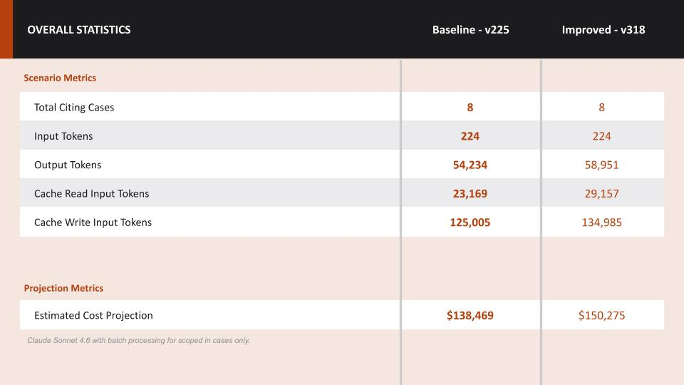
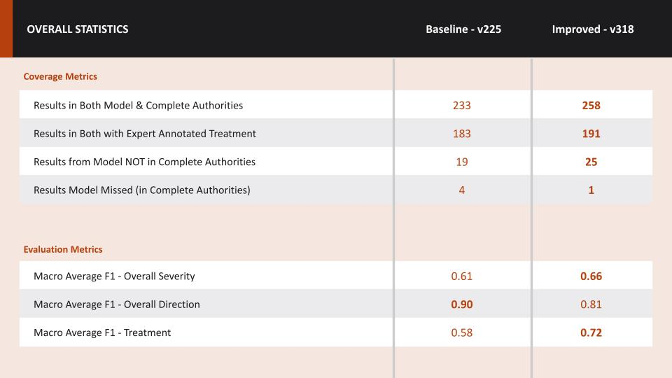
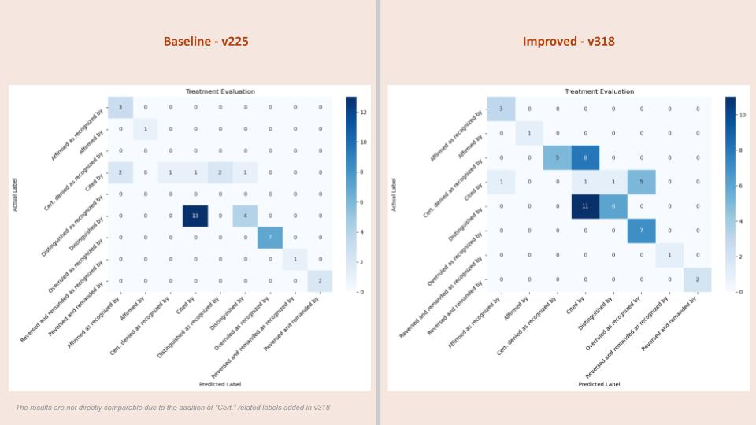
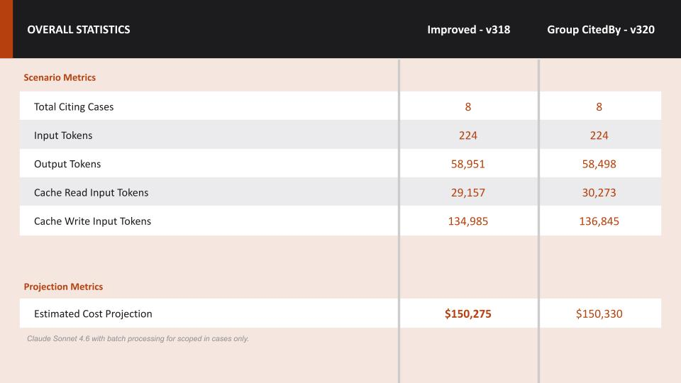
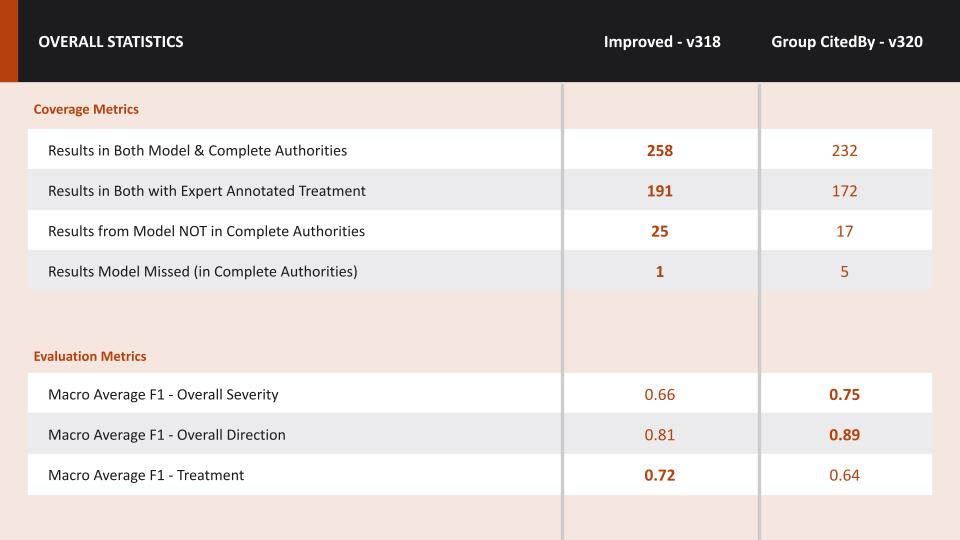
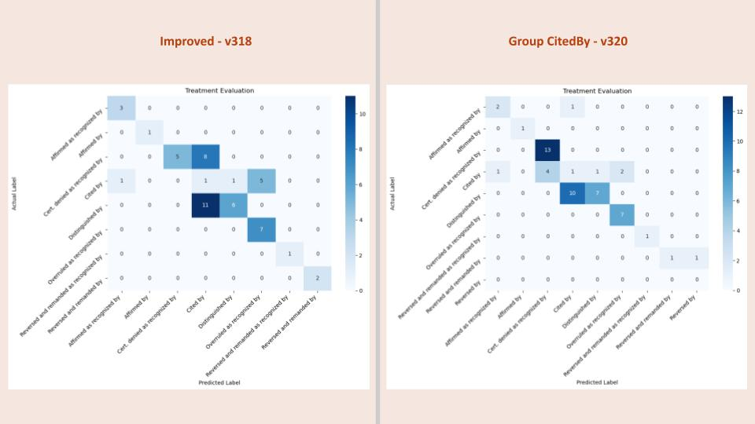

# What this folder contains
1. Select an eval set
Eval set: 110274, 117849, 103543, 110420, 110360, 7774813, 725046, 101625
2. Run eval set against v225 and v318 and v320 prompt
- v225 - Baseline
- v318 - Enhanced from Baseline based on reviewed results + added "Cert. denied by" and "Cert. granted by" labels
- v320 - Revise v318 to have the model group the "cited by" outputs

## Results comparison between v225 and v318

1. v318 would be more expensive because it includes some more nuanced instructions which produces better results

2. v318 produces more comprehensive results and more accurate predictions. The score for direction is lower when compared to v225 although this is not directly comparable because v318 introduced "Cert." related treatments which v225 considered "Cited by"

3. Confusion matrix showing where the models made mistakes. Again, results are not directly comparable because v318 introduced "Cert." related treatments which v225 considered "Cited by"

## Results comparison between v318 and v320

1. Even though the model was instructed to group the "Cited by" cases and not produce them in the detailed output in the v320 prompt, it still produced some of them in the details output. Therefore, this approach did not produce any cost savings.

2. v320 also produced less comprehensive results than v318. This could be a result of the model was instructed to perform too much tasks in one prompt.

3. Confusion matrix showing where the models made mistakes. Surprisingly, v320 produced better results for "Cert. denied as recognized by" class, this may be a result of the post processing step, where the model produced "Cert." treatments in addition to the "Cited by" treatment and the post processing step kept only the "Cert." treatment. This creates an opportunity for improvement, where we ask the model to produce all treatments applied to the cited case and we use a heuristic approach to present the most negative treatment as the final treatment.

